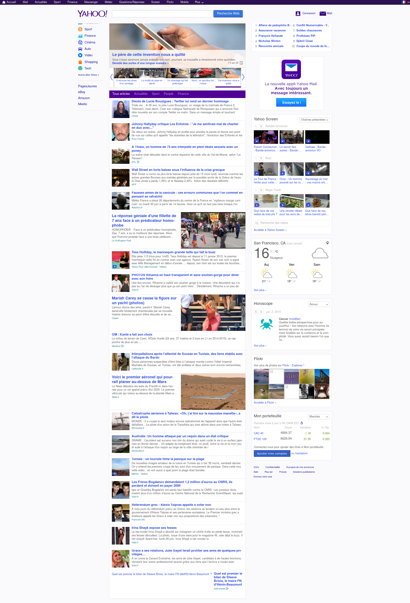

# Yahoo project:

This is my exercise for the HTML5-CSS3 week 1.

## Excepted:

## 1 - I created a responsive grid system for the columns. (max columns 12)

    .grid_1
                    -->
                        1 column  repeat
    .grid_1_2
                    -->
                        2 columns repeat
    .grid_1_2_3
                    -->
                        3 columns repeat
    .grid_1_2_3_4
                    -->
                        4 columns repeat
    .grid_1_2_3_4_6
                    -->
                        6 columns repeat
    .grid_7
                    -->
                        7 columns repeat
    .grid_12
                    -->
                        12 columns repeat

## 2 - I made an header with the navigation bar and the searchbar:

    #nav_container
                    -->
                        this is the top menu
    #search_container
                    -->
                        this is the top searchbar with logo

## 3 - I divided my section into 3 parts:

    #section_left 
                    -->
                        lateral menu
    #section_middle
                    --> 
                        figure
                        slide
                        article container
    #section_right
                    -->
                        ordered list
                        yahoo mail
                        yahoo screen
                        yahoo meteo
                        yahoo horoscope
                        yahoo flickr
                        yahoo wallet
